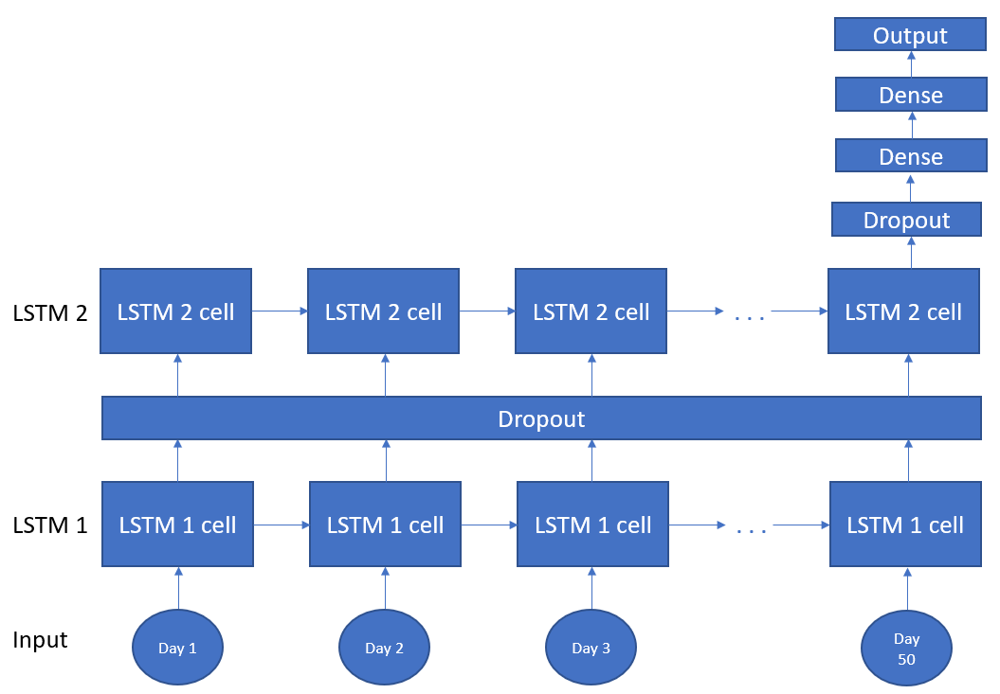
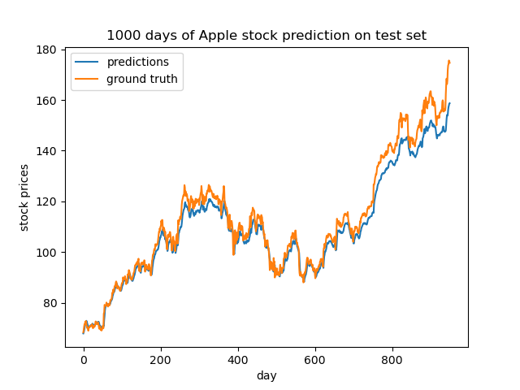
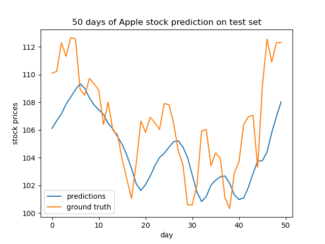

# Stock Up!
Stock prediction with machine learning has been a hot topic in the recent years. In this project, I attempt to use a time-series sequence model to predict the Apple stock prices. The intuition behind using an LSTM network is because an LSTM tries to encapsulate a time-series meaning behind the sequence better than other models. So maybe by using less data (just 50 days of stock prices), the LSTM network may be able to eextract 

## Data setup
I took the daily Apple stock prices from 1984-2017. I do my training and predictions on the closing price of each day. I split my dataset into two sets: training and test. The test set contains the most recent 1000 days while the training set contains the rest. I chose to separate it like this rather than random assignment because the test set would've been biased by cross-over from the training set. But all bias isn't completely removed in this approach

A potentially more interesting data split would've been training on all stock prices of the Apple stock, then testing on a completely different stock. 

## Long Short Term Memory (LSTM) network
A LSTM network is a type of sequence model neural network. The first day stock price is ran through an "LSTM cell". The "LSTM cell" can be thought of as a neural network layer. It then produces an output. This output and the second day's stock price is then fed into the LSTM cell again. This process repeats until the 50th day's stock price is fed in to produce a final output.

My model consists of two LSTM models followed by two dense layers. It first takes in the input into the first LSTM layer, where each cell takes in each consecutive day. Each cell then outputs an activation to the next layer. A dropout layer is also applied here. Then, each cell's activation from the first LSTM layer is passed into the second LSTM. Only the last cell in this layer will return an activation. This activation goes through a dropout layer. Then, the output is passed through two dense layers.

## First task: Predicting stock price
The first task I wanted to do was to attempt to predict tomorrow's stock price given the past 50 days of stock prices. Note the last dense layer's activation function is ReLU.

Train loss: 4.91e-4

Test loss: 2.38e-4

Looking at the predictions of 1000 days worth of data, we can see the model does a fairly good job of predicting very close to the stock price. 

Zooming in, we can see more variance between the prediction and the stock price. But we can see the prediction does follow the trend of the data as well. So even though the model isn't perfect at predicting the exact next day stock price, can this model predict a simpler task of whether the next day is going up or down?

## Second task: Predicting next day up/down
The second task I attempted was to predict whether the next day's stock price will go up or down. Note the last dense layer's activation function has to change to sigmoid for this to work. We see that we can at least beat random guessing (which is 50%). But apart from that, it isn't too accurate. This is probably because we are only using 50 days worth of data. Stock prices, in itself, are very random and volatile without any other information. While I thought there might be more meaning behind the 50 days of data an LSTM could capture, there actually wasn't too much to capture as the state of the data is too random. But hey, it is still better than random guessing so that is an accomplishment in my book.

Train accuracy: 51.20%

Test accuracy: 52.84%